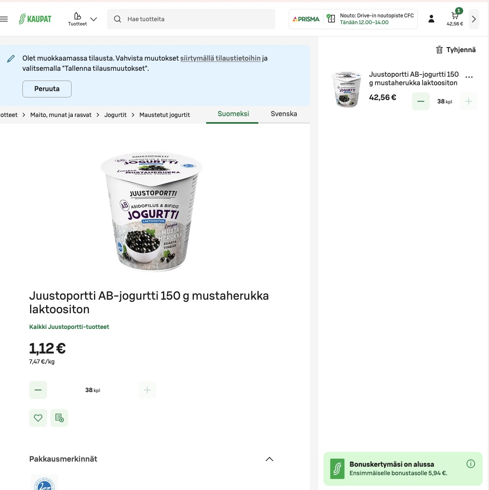
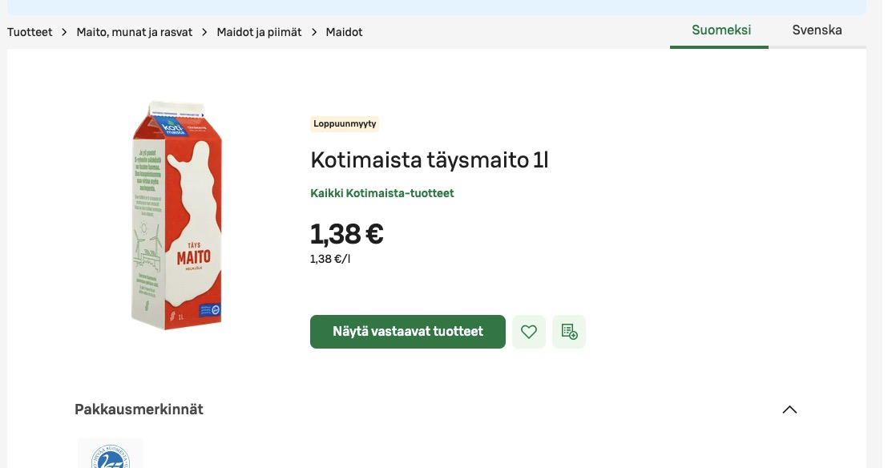
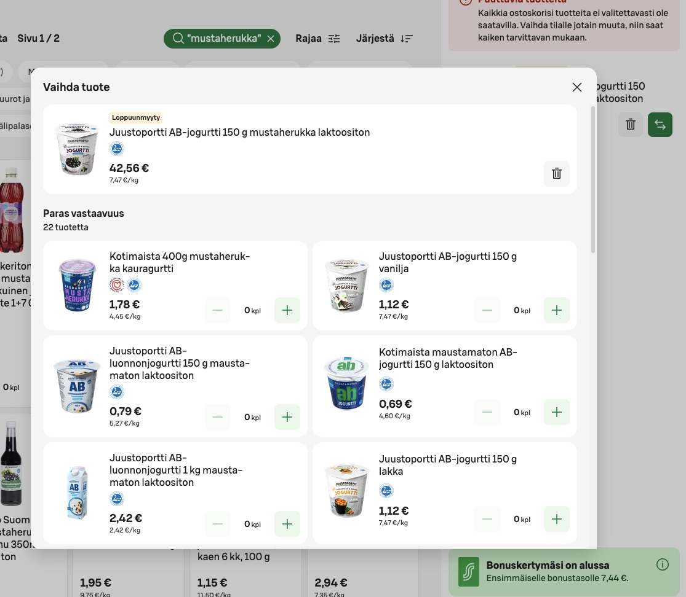
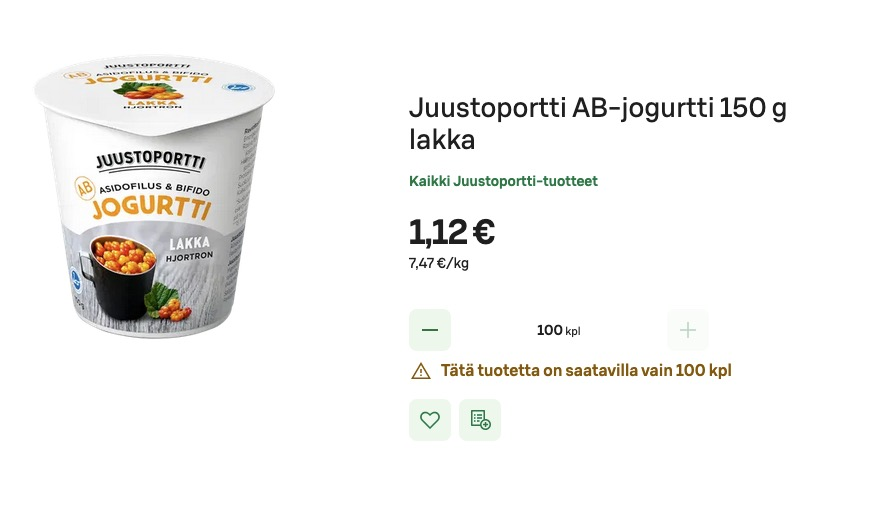

theme: c64

# Label Renewal Epic

SKA-11850 — Status Overview

---

# Unified Availability Labels

- Unified "Ei valikoimassa" and "Ei saatavilla" into one "Ei valikoimassa" label
- Removed outdated labels (poistumassa, Epävarma saatavuus)
- Changed "Saatavilla xx.xx." to show as "Loppuunmyyty"
- Hid "loppuunmyyty" label when item is in cart while editing order (utilize cart validation)

|||

---

# Clear CTAs for Unavailable Products

- Added CTAs for sold out products
- Removed add-to-cart button from unavailable product cards

|||

---

# Product Switch

- Prevented sold out products from being promoted in product switch

|||

---

# Backend Work

- New resolvers to GQL that provide labels in context
- Order, search and cart-validation now have own resolvers

---

# Cross-Platform Consistency

- Fixed favorites product label handling
- Fixed past orders product label handling
- Unified missing products notification (in review)

---

# Release Status

- Web features mostly live
- Most app features regarding labels behind a feature flag, intent to release soon

---

# Coming Up Next

- Limited availability messaging in cart and product page (web in review, app to do)
- Shopping list: availability handling and user notifications

|||

---

# Summary

- 32 done, 3 in review, 4 to do
- Remaining work focuses on app parity and shopping list consistency
